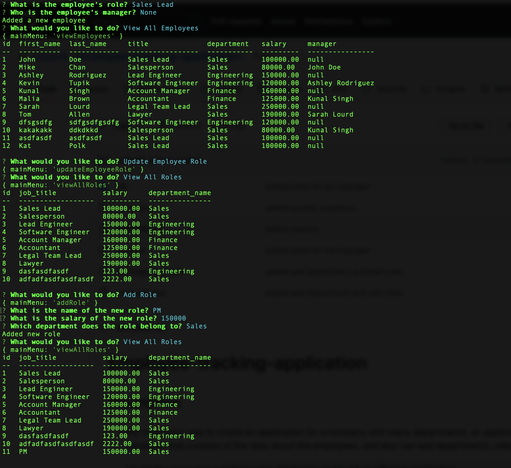

# Employee-tracking-application

## Description

- My motivation was to create an application for a company with many departments, an application with a database that consists of the data about the employees, and also can add departments, roles, and employees. 

- I build this project to practice using databases and build an efficient application. 

- This application allows users to keep track of all employees in the company, it is usefull for larger companies with many departments. All information about an employees and a role  is kept in one database. 

- I learned a lot about databases. 

Github link: https://github.com/catpolk/employee-tracking-application-

